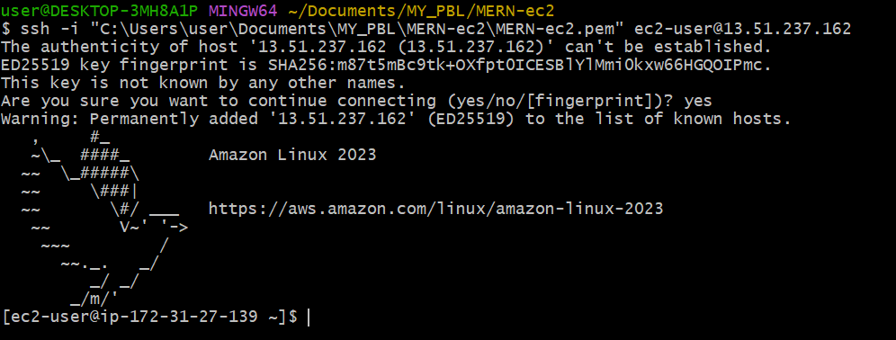
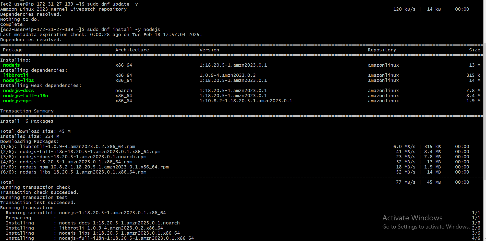
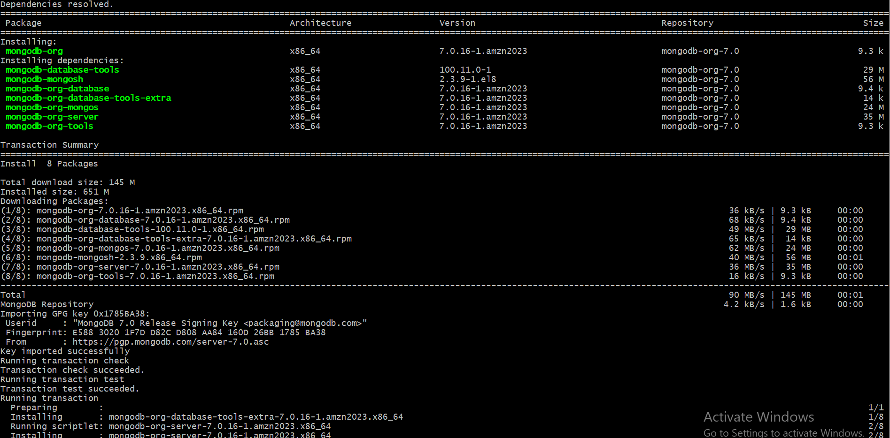
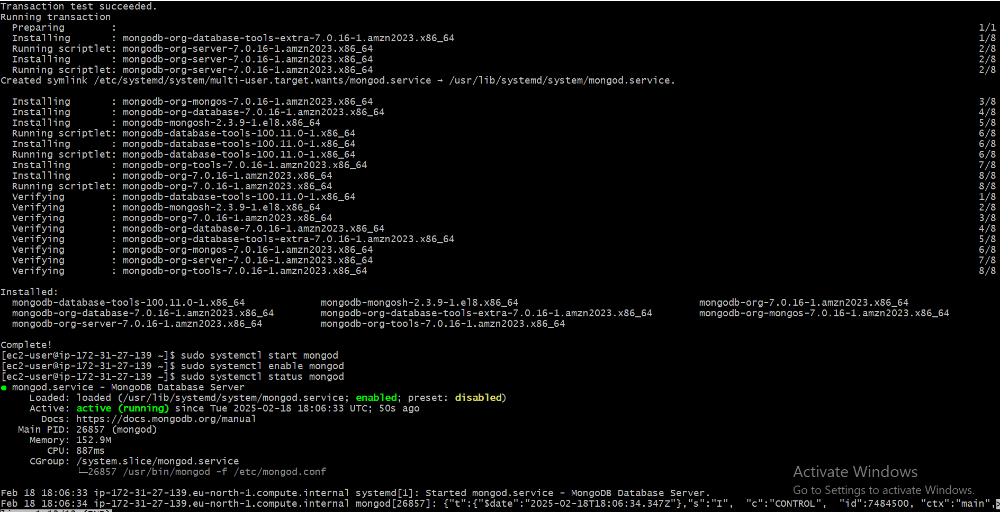

# MERN Stack
## Launch and Connect to EC2

* Launch an EC2 instance: search ec2 - click launch instance - Name the instance (Ecommerce-sever) - select Amazon linux as AMI OS - instance type (t3 micro free tier) - create new key pair and download - setup security group - launch instance.

Below shows the instance in running state

* Connect to the EC2 instance through ssh: Once my instance started running, I connected to it from my local machine using ssh by running the command - **ssh -i "C:\Users\user\Documents\MY_PBL\MERN-ec2\MERN-ec2.pem" ec2-user@13.51.237.162**. The result is shown below

### Since I am  using Amazon Linux 2023, which is based on Fedora/RHEL rather than Debian/Ubuntu. In Amazon Linux, apt is not available because it uses dnf (or yum in older versions) as the package manager.

* Next step is to first update the system using - **sudo dnf update -y**
* Then install node.js using the command **sudo dnf install -y nodejs**
* Check the version installed using **node -v** and **npm -v**
This is shown below

* Next step is installing MongoDB:
    * Add the MongoDB repository
    
    * Install MongoDB - **sudo dnf install -y mongodb-org**
    * Start MongoDB on boot - **sudo systemctl start mongod** 
    * Enable MongoDB on boot - **sudo systemctl enable mongod**

    The image of mongoDB installation is shown below
    
    * Verify MongoDB is running - **sudo systemctl status mongod**

    The proof of mongoDB running is shown below
    

* To be able to push your changes to the remote repostitory, first install git - **sudo yum install git**

* Then after pushing you changes to the remote repository, you have to clone your remote repository using - **git clone  https://github.com/olamidey-io/Project8---MERN-stack.git** and then cd into it - **cd Project8---MERN-stack**. Image of these shown below

